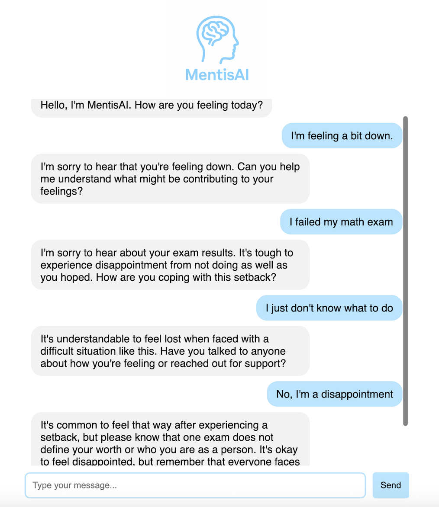

# MentisAI

MentisAI is a minimalist chat app that simulates a thoughtful virtual therapist. Built with React and Python (Flask) and powered by OpenAI’s GPT-3.5 model, it guides users through open-ended conversations that help them reflect on their thoughts and emotions in a supportive space.



## Tech Stack
- **Frontend**: React (Vite), HTML, CSS
- **Backend**: Python + Flask, OpenAI API

## Installation Guide
### 1. **Clone the repo**
   ```bash
   git clone https://github.com/yourusername/MentisAI.git
   cd mentisai
   ```

### 2. **Setup and run the backend**  
First, create and activate a virtual environment (recommended).

- For **macOS/Linux** users:
    ```bash
    cd backend
    python -m venv venv
    source venv/bin/activate
    pip install -r requirements.txt
    ```

- For **Windows** users:
    ```bash
    cd backend
    python -m venv venv
    venv\Scripts\activate
    pip install -r requirements.txt
    ```

Then, add your OpenAI API key in the .env file in the backend directory (replace **sk-your-key-here** with your key):
```
OPENAI_API_KEY=sk-your-key-here
```

Lastly, start the backend server:
```bash
python main.py
```
The backend will run on http://localhost:5001

### 3. **Setup and run the frontend**

In a new terminal window:
```bash
cd frontend
npm install
npm run dev
```

Now, open your browser and go to http://localhost:5173 to start chatting with MentisAI!